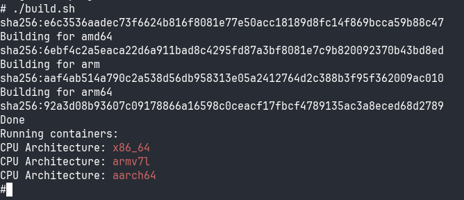

# docker-multiarch-build
Test docker multiarch build

Assuming that `scripts/build_app.sh` is a large complex script(-s) that produces a single binary.

Build a docker multiarch image for several architecures and upload to https://hub.docker.com/.

Then run containers for individual architectures.

## Instructions

1. Edit `build.sh`, adjust `NAME` with your dockerhub username and image name, e.g. "john/test-multiarch"
2. run `./build.sh`
3. you should see the following output on the screen:

